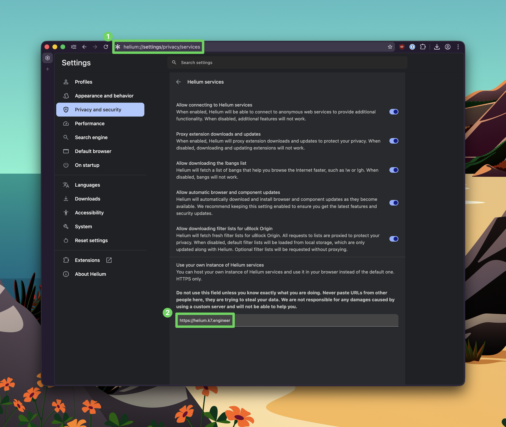

# helium services

Private fork of the Helium browser services for Kindness, hosted on *helium.k7.engineer*. This setup gives us control over user privacy and provides additional bandwidth for tasks such as Chrome extension proxying, which can be quite slow with the public Helium services. Additionally, in the future, we can deploy a custom uBlock Origin block list to all Kindness employees or create custom bangs for our internal services, such as Linear or the Kindness webapp.

## To use Kindness's Helium services, you will need to:

1. Download and install the Helium browser from the [Helium website](https://www.helium.imput.net/).
2. During the setup or if already setup, add the following URL to "Use your own instance of Helium Services" setting on helium://settings/privacy/services: `https://helium.k7.engineer`

